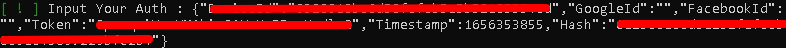

# STUMBLE GUYS EXPLOIT
[]([https://google.com](https://github.com/xyzyyyy/StumbleGuys))

### Easy to Get Trophy & Crown
  
---
</div>

## CONTOH AUTH TOKEN 
<div align="center">
  
---
</div>

## DESKRIPSI 

- Gunakan HTTP Canary untuk mengambil token auth 
- Jika perangkat Anda tidak di-root, maka gunakan aplikasi ganda seperti Ruang Paralel (pararel space)
- Jika Anda menjalankan skrip, jangan masuk ke akun Anda terlebih dahulu karena itu akan mengatur ulang token auth 
- Risiko Anda sendiri! Alat ini memiliki risiko akun Anda diblokir! 
- Jika ponsel Anda diblokir oleh perangkat dan tidak di root, maka Anda harus mengatur ulang data ponsel Anda 
- Jika ponsel Anda diblokir oleh perangkat dan di-root, maka Anda hanya perlu menginstal aplikasi pengubah id perangkat untuk mengatur ulang id perangkat Anda

## INSTALL 

### WINDOWS 

- Download [NodeJS](https://nodejs.org/en/)
- Download [Git](https://git-scm.com/downloads)

```bash
$ git clone https://github.com/xyzyyyy/StumbleGuys
$ cd StumbleGuys
$ npm install
$ npm start
or
$ node index
```

### TERMUX

- Download [HTTP CANARY](https://download.apkcombo.com/com.guoshi.httpcanary/HttpCanary%20%E2%80%94%20HTTP%20Sniffer%2FCapture%2FAnalysis_3.3.6_apkcombo.com.apk?ecp=Y29tLmd1b3NoaS5odHRwY2FuYXJ5LzMuMy42LzU4LmJiM2RhNTU5NmMxMTA2OWNhMWQyZGFjNmYwM2MxY2MyMDAyYjhiZjYuYXBr&iat=1656356651&sig=467bffadfac8a0a98be0473b8e0eb47b&size=5218787&from=cf&version=latest&lang=en&fp=f017b18209583f5943f6a4556871dfd5&ip=20.239.65.17)

```bash
$ pkg update 
$ pkg upgrade -y
$ pkg install git -y
$ pkg install nodejs -y
$ git clone https://github.com/xyzyyyy/StumbleGuys
$ cd StumbleGuys
$ npm install
$ npm start
or
$ node index
```
